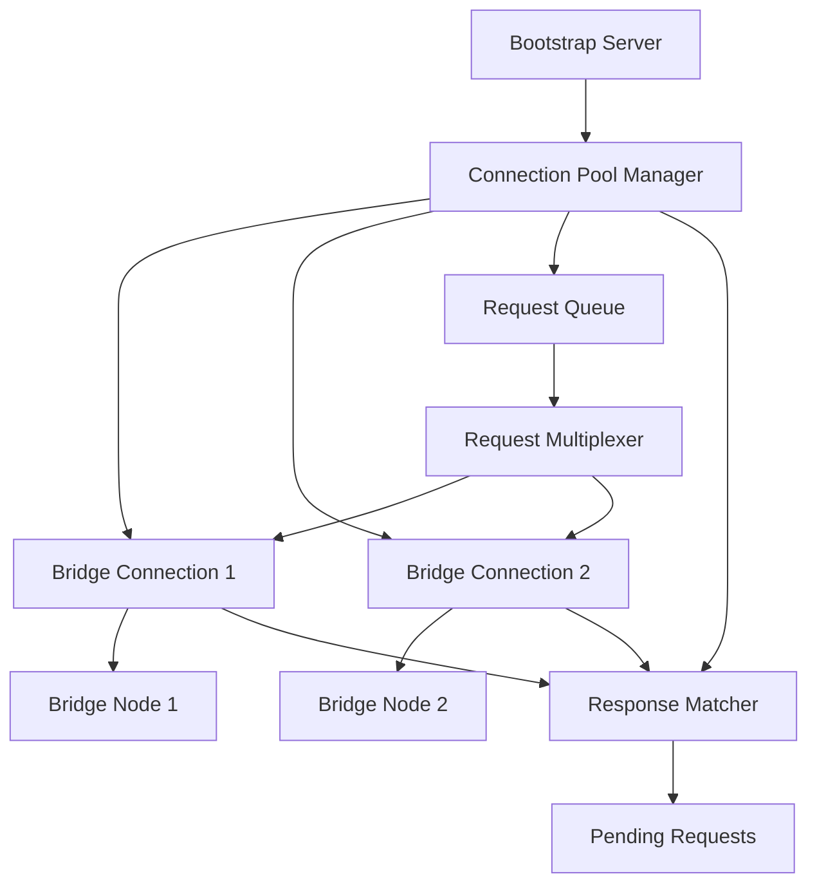

# Design Document: Bridge Connection Management

## Overview

This design implements a persistent connection pool architecture between the bootstrap server and bridge nodes to eliminate the connection storm issue that's currently overwhelming bridge nodes. The solution uses intelligent connection management with automatic cleanup during idle periods.

## Architecture

### Current Problem Analysis

The existing architecture creates a new WebSocket connection for every onboarding request:
- Bootstrap server receives peer join request
- Creates new WebSocket connection to bridge node
- Authenticates, sends request, waits for response
- Closes connection after single use

With 15+ DHT nodes joining simultaneously, this creates 15+ concurrent connections per bridge node, leading to:
- Resource exhaustion on bridge nodes (558+ connections observed)
- Connection timeouts and failures
- Bridge nodes unable to process legitimate requests
- DHT network fragmentation (bridge nodes show 0 peers)

### Proposed Solution: Smart Connection Pool



## Components and Interfaces

### 1. Connection Pool Manager

**Purpose**: Manages persistent WebSocket connections to bridge nodes with intelligent lifecycle management.

**Key Features**:
- Maintains exactly one connection per bridge node
- Automatic reconnection with exponential backoff
- Connection health monitoring with ping/pong
- Idle timeout with smart reconnection

```javascript
class BridgeConnectionPool {
  constructor(bridgeNodes, options = {}) {
    this.connections = new Map(); // bridgeAddr -> BridgeConnection
    this.requestQueue = new RequestQueue();
    this.responseHandler = new ResponseHandler();
    this.idleTimeout = options.idleTimeout || 300000; // 5 minutes
    this.healthCheckInterval = options.healthCheckInterval || 30000; // 30 seconds
  }

  async getConnection(bridgeAddr) {
    // Returns existing connection or creates new one
  }

  async sendRequest(request) {
    // Multiplexes request over available connections
  }
}
```

### 2. Smart Connection Lifecycle

**Idle Management**: Connections automatically close after 5 minutes of inactivity but reconnect instantly when needed.

**Connection States**:
- `CONNECTING`: Establishing WebSocket connection
- `AUTHENTICATING`: Sending auth credentials
- `READY`: Available for requests
- `BUSY`: Processing requests but can accept more
- `IDLE`: No active requests, eligible for cleanup
- `DISCONNECTED`: Connection lost, will retry
- `FAILED`: Permanent failure, excluded from rotation

### 3. Request Multiplexing System

**Request Flow**:
1. Bootstrap receives onboarding request
2. Assigns unique request ID (`req_${timestamp}_${random}`)
3. Queues request with timeout handler
4. Sends over available bridge connection
5. Correlates response using request ID
6. Returns result to original requester

**Message Format**:
```javascript
// Request
{
  type: 'get_onboarding_peer',
  requestId: 'req_1766370123456_abc123',
  newNodeId: '906a8989...',
  newNodeMetadata: { nodeType: 'nodejs', ... },
  timestamp: 1766370123456
}

// Response
{
  type: 'onboarding_peer_response',
  requestId: 'req_1766370123456_abc123',
  success: true,
  data: { inviterPeerId: '7926c54e...', ... }
}
```

### 4. Bridge Node Message Queue

**Purpose**: Handle multiple concurrent requests without blocking the WebSocket connection.

**Implementation**:
```javascript
class BridgeRequestHandler {
  constructor() {
    this.requestQueue = [];
    this.processing = false;
    this.maxConcurrent = 10;
  }

  async handleRequest(ws, message) {
    if (this.requestQueue.length >= this.maxConcurrent) {
      // Send busy response instead of dropping connection
      ws.send(JSON.stringify({
        type: 'onboarding_peer_response',
        requestId: message.requestId,
        success: false,
        error: 'Bridge node busy, try again'
      }));
      return;
    }

    this.requestQueue.push({ ws, message });
    this.processQueue();
  }
}
```

## Data Models

### Connection Pool State

```javascript
{
  bridgeConnections: {
    'wss://imeyouwe.com/bridge1': {
      status: 'READY',
      connection: WebSocket,
      lastActivity: timestamp,
      pendingRequests: Map<requestId, Promise>,
      healthCheck: {
        lastPing: timestamp,
        lastPong: timestamp,
        failures: 0
      }
    }
  },
  requestQueue: [
    {
      requestId: 'req_123',
      bridgeAddr: 'wss://imeyouwe.com/bridge1',
      request: {...},
      timeout: timestamp,
      resolve: Function,
      reject: Function
    }
  ]
}
```

## Correctness Properties

*A property is a characteristic or behavior that should hold true across all valid executions of a system-essentially, a formal statement about what the system should do. Properties serve as the bridge between human-readable specifications and machine-verifiable correctness guarantees.*

### Property 1: Connection Pool Consistency
*For any* bridge node address, there should be at most one active WebSocket connection in the connection pool at any given time.
**Validates: Requirements 1.1**

### Property 2: Request-Response Correlation
*For any* onboarding request sent through the connection pool, the response should be matched to the correct pending request using the request ID.
**Validates: Requirements 2.3**

### Property 3: Connection Recovery
*For any* bridge connection that fails, the connection pool should automatically attempt reconnection with exponential backoff until successful or permanently failed.
**Validates: Requirements 1.2**

### Property 4: Request Timeout Handling
*For any* onboarding request that doesn't receive a response within the timeout period, the request should be failed and cleaned up from pending requests.
**Validates: Requirements 2.4**

### Property 5: Load Distribution
*For any* set of available bridge connections, onboarding requests should be distributed across healthy connections using round-robin selection.
**Validates: Requirements 5.3**

### Property 6: Resource Cleanup
*For any* completed or timed-out request, all associated resources (pending request entries, timeout handlers) should be cleaned up promptly.
**Validates: Requirements 6.4**

### Property 7: Idle Connection Management
*For any* bridge connection that has been idle for longer than the idle timeout, the connection should be closed and marked for reconnection on next use.
**Validates: Requirements 1.1, 6.1**

## Error Handling

### Connection Failures
- **WebSocket errors**: Automatic reconnection with exponential backoff (1s, 2s, 4s, 8s, max 30s)
- **Authentication failures**: Mark bridge as permanently failed, exclude from rotation
- **Timeout errors**: Retry request on different bridge if available

### Request Failures
- **Bridge busy**: Retry on different bridge or queue for later
- **Request timeout**: Clean up pending request, return error to client
- **Invalid response**: Log error, retry request once

### Resource Exhaustion
- **Too many pending requests**: Implement backpressure, reject new requests temporarily
- **Memory pressure**: Force cleanup of idle connections and completed requests
- **Bridge overload**: Distribute load to other bridges, implement circuit breaker

## Testing Strategy

### Unit Tests
- Connection pool lifecycle management
- Request multiplexing and correlation
- Error handling and recovery scenarios
- Resource cleanup verification

### Property-Based Tests
- Connection pool consistency across concurrent operations
- Request-response correlation under load
- Load balancing distribution fairness
- Resource cleanup completeness

### Integration Tests
- End-to-end onboarding flow with connection pooling
- Bridge node failure and recovery scenarios
- High-load testing with 100+ concurrent requests
- Memory usage validation under sustained load

### Performance Tests
- Latency comparison: pooled vs stateless connections
- Throughput testing: concurrent onboarding requests
- Resource usage monitoring: memory and connection counts
- Stress testing: bridge node capacity limits

## Implementation Notes

### Phase 1: Connection Pool Infrastructure
- Implement BridgeConnectionPool class
- Add connection lifecycle management
- Implement basic request multiplexing

### Phase 2: Smart Idle Management
- Add idle timeout and cleanup logic
- Implement automatic reconnection
- Add connection health monitoring

### Phase 3: Load Balancing and Resilience
- Implement round-robin load balancing
- Add circuit breaker for failed bridges
- Implement backpressure handling

### Phase 4: Monitoring and Metrics
- Add connection pool metrics
- Implement performance monitoring
- Add debugging and troubleshooting tools

This design directly addresses the connection storm issue by reducing the number of WebSocket connections from hundreds to just 2 (one per bridge node), while maintaining high throughput through request multiplexing and intelligent connection management.