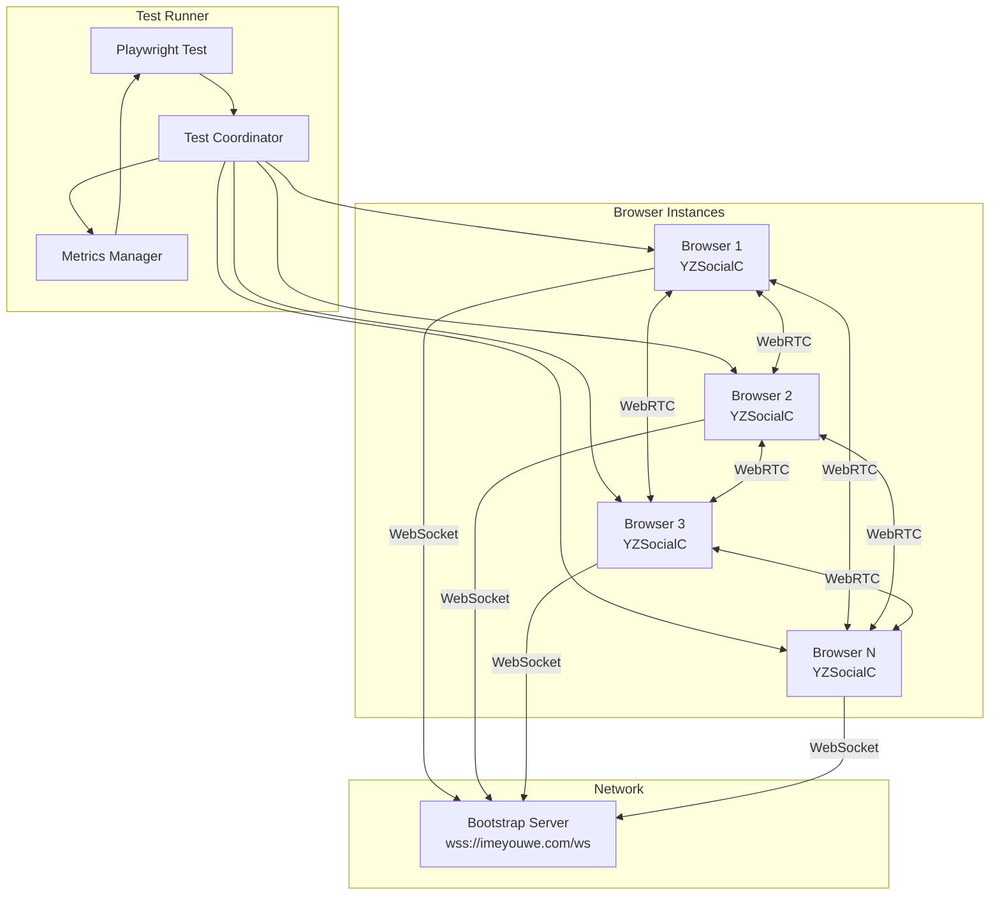

# Design Document: Browser Mesh Stability Tests

## Overview

This design describes Playwright browser tests that verify network stability in the YZ.Network mesh. The tests launch multiple browser instances, connect them to the DHT network, and verify:

1. Browser-to-browser connections use WebRTC (not WebSocket)
2. Multiple browsers form a complete mesh network
3. Connections remain stable over time
4. Metrics provide visibility into network health

The tests integrate with the existing Playwright test infrastructure and use the production bootstrap server at `wss://imeyouwe.com/ws`.

## Architecture



### Test Flow

1. **Setup Phase**: Launch N browser instances, each loading the YZSocialC application
2. **Connection Phase**: Each browser starts DHT and connects to bootstrap server
3. **Discovery Phase**: Browsers discover each other through DHT
4. **Mesh Formation**: Browsers establish direct WebRTC connections
5. **Verification Phase**: Verify connection types and mesh completeness
6. **Monitoring Phase**: Track connection stability over time
7. **Metrics Phase**: Calculate and report stability metrics
8. **Teardown Phase**: Stop DHT on all browsers, close browser instances

## Components and Interfaces

### TestCoordinator

Manages multiple browser instances and coordinates test execution.

```javascript
class TestCoordinator {
  constructor(browserCount = 4) {
    this.browserCount = browserCount;
    this.browsers = [];      // Playwright Browser instances
    this.pages = [];         // Playwright Page instances
    this.nodeIds = [];       // DHT node IDs for each browser
    this.metricsManager = new MetricsManager();
  }

  // Launch all browser instances
  async launchBrowsers(playwright) { }
  
  // Start DHT on all browsers and wait for connections
  async connectAll(timeout = 60000) { }
  
  // Get connection info from a specific browser
  async getConnectionInfo(pageIndex) { }
  
  // Verify all browsers have formed a mesh
  async verifyMeshFormation(timeout = 120000) { }
  
  // Start monitoring connections for stability
  async startMonitoring(durationMs = 60000) { }
  
  // Stop all DHT instances and close browsers
  async teardown() { }
}
```

### ConnectionVerifier

Verifies connection types match architecture requirements.

```javascript
class ConnectionVerifier {
  // Get connection type for a specific peer
  static async getConnectionType(page, peerId) { }
  
  // Verify browser-to-browser uses WebRTC
  static async verifyWebRTCConnection(page, peerId) { }
  
  // Verify browser-to-nodejs uses WebSocket
  static async verifyWebSocketConnection(page, peerId) { }
  
  // Get all peer connections with their types
  static async getAllConnectionTypes(page) { }
}
```

### MetricsManager

Tracks and calculates stability metrics.

```javascript
class MetricsManager {
  constructor() {
    this.connections = new Map();  // peerId -> ConnectionMetrics
    this.events = [];              // All connection events
    this.startTime = null;
    this.endTime = null;
  }

  // Record a connection event
  recordEvent(type, peerId, timestamp, metadata = {}) { }
  
  // Calculate uptime percentage for a connection
  calculateUptime(peerId) { }
  
  // Calculate churn rate (disconnects per minute)
  calculateChurnRate() { }
  
  // Calculate MTBF for connections with failures
  calculateMTBF(peerId) { }
  
  // Get summary of all metrics
  getSummary() { }
  
  // Check if connection is stable (>99% uptime)
  isStable(peerId) { }
}
```

### ConnectionMetrics

Data structure for per-connection metrics.

```javascript
class ConnectionMetrics {
  constructor(peerId) {
    this.peerId = peerId;
    this.connectTime = null;
    this.disconnectTimes = [];
    this.reconnectTimes = [];
    this.totalConnectedTime = 0;
    this.totalDisconnectedTime = 0;
  }
}
```

## Data Models

### ConnectionEvent

```javascript
{
  type: 'connect' | 'disconnect' | 'reconnect',
  peerId: string,
  timestamp: number,
  connectionType: 'webrtc' | 'websocket' | null,
  metadata: {
    reason?: string,
    previousState?: string,
    newState?: string
  }
}
```

### MeshStatus

```javascript
{
  totalNodes: number,
  connectedPairs: number,
  expectedPairs: number,        // n * (n-1) / 2 for full mesh
  isComplete: boolean,
  missingConnections: Array<{from: string, to: string}>,
  formationTimeMs: number
}
```

### StabilityReport

```javascript
{
  duration: number,             // Monitoring duration in ms
  totalConnections: number,
  totalDisconnects: number,
  totalReconnects: number,
  churnRate: number,            // Disconnects per minute
  connections: Array<{
    peerId: string,
    connectionType: string,
    uptime: number,             // Percentage 0-100
    mtbf: number | null,        // Mean time between failures in ms
    isStable: boolean           // uptime >= 99%
  }>,
  overallStability: boolean     // All connections stable
}
```

### TestConfiguration

```javascript
{
  browserCount: number,         // Default: 4, minimum: 3
  meshFormationTimeout: number, // Default: 120000ms
  monitoringDuration: number,   // Default: 60000ms
  stabilityThreshold: number,   // Default: 99 (percent)
  bootstrapUrl: string          // Default: 'wss://imeyouwe.com/ws'
}
```


## Correctness Properties

*A property is a characteristic or behavior that should hold true across all valid executions of a system—essentially, a formal statement about what the system should do. Properties serve as the bridge between human-readable specifications and machine-verifiable correctness guarantees.*

### Property 1: Browser-to-Browser Connections Use WebRTC

*For any* pair of Browser_Nodes that establish a connection, the connection manager type SHALL be WebRTCConnectionManager.

**Validates: Requirements 1.1, 1.4**

### Property 2: Browser-to-NodeJS Connections Use WebSocket

*For any* Browser_Node connecting to a Node_JS_Node (including the bootstrap server), the connection manager type SHALL be WebSocketConnectionManager.

**Validates: Requirements 1.2**

### Property 3: Mesh Completeness Invariant

*For any* set of N Browser_Nodes (where N >= 3) that have completed mesh formation, the total number of peer-to-peer connections SHALL equal N * (N-1) / 2, and each node SHALL have exactly N-1 peer connections.

**Validates: Requirements 2.1, 2.2**

### Property 4: Event Tracking Accuracy

*For any* sequence of connection state changes (connect, disconnect, reconnect), the MetricsManager SHALL record each event with a timestamp, and the recorded event count SHALL equal the actual number of state changes that occurred.

**Validates: Requirements 3.1, 3.2**

### Property 5: Uptime Calculation Correctness

*For any* connection with recorded connect/disconnect events, the uptime percentage SHALL equal (total connected time / total monitoring time) * 100, where total connected time is the sum of all periods the connection was active.

**Validates: Requirements 4.1**

### Property 6: Churn Rate Calculation Correctness

*For any* monitoring period with recorded disconnect events, the churn rate SHALL equal (total disconnects / monitoring duration in minutes).

**Validates: Requirements 4.2**

### Property 7: MTBF Calculation Correctness

*For any* connection with at least one failure, the MTBF SHALL equal (total uptime / number of failures). For connections with zero failures, MTBF SHALL be null.

**Validates: Requirements 4.3**

### Property 8: Event Count Invariant

*For any* MetricsManager instance, the total event count SHALL equal the sum of connect events + disconnect events + reconnect events.

**Validates: Requirements 4.4**

### Property 9: Stability Threshold Correctness

*For any* connection, isStable SHALL return true if and only if uptime >= 99%.

**Validates: Requirements 4.6**

## Error Handling

### Connection Failures

| Error Condition | Handling Strategy |
|-----------------|-------------------|
| Browser fails to load YZSocialC | Fail test with descriptive error, include page console logs |
| DHT connection timeout | Retry once, then fail with connection state details |
| Mesh formation timeout | Report missing connections, fail with partial mesh status |
| WebRTC connection failure | Log ICE candidate details, record as disconnect event |
| Bootstrap server unreachable | Fail immediately with network error details |

### Test Infrastructure Errors

| Error Condition | Handling Strategy |
|-----------------|-------------------|
| Browser launch failure | Retry browser launch, fail if persistent |
| Page crash during test | Record crash event, attempt graceful teardown |
| Timeout during monitoring | Complete with partial metrics, flag incomplete |

### Metrics Edge Cases

| Edge Case | Handling |
|-----------|----------|
| Zero monitoring duration | Return 0% uptime, 0 churn rate |
| No disconnect events | Return 100% uptime, null MTBF |
| Connection never established | Exclude from metrics, report as failed connection |

## Testing Strategy

### Dual Testing Approach

The test suite uses both unit tests and property-based tests:

- **Unit tests**: Verify specific examples, edge cases, and integration points
- **Property tests**: Verify universal properties across generated inputs

### Property-Based Testing Configuration

- **Library**: fast-check (JavaScript property-based testing library)
- **Iterations**: Minimum 100 iterations per property test
- **Tag format**: `Feature: browser-mesh-stability-tests, Property {number}: {property_text}`

### Test Categories

#### 1. Unit Tests for MetricsManager

- Test uptime calculation with specific event sequences
- Test churn rate with known disconnect counts
- Test MTBF with specific failure patterns
- Test edge cases (zero duration, no events, single event)

#### 2. Property Tests for Metrics Calculations

- Property 5: Uptime calculation with random event sequences
- Property 6: Churn rate with random disconnect counts and durations
- Property 7: MTBF with random failure patterns
- Property 8: Event count invariant with random event streams
- Property 9: Stability threshold with random uptime values

#### 3. Integration Tests (Playwright)

- Property 1: WebRTC verification with multiple browser pairs
- Property 2: WebSocket verification for bootstrap connection
- Property 3: Mesh formation with configurable N browsers
- Property 4: Event tracking during stability monitoring

### Test File Structure

```
tests/
├── browser/
│   ├── mesh-stability.spec.js      # Main Playwright integration tests
│   └── connection-type.spec.js     # WebRTC/WebSocket verification tests
└── unit/
    └── metrics-manager.test.js     # Unit and property tests for MetricsManager
```

### CI/CD Considerations

- Stability tests require longer timeouts (mesh formation + monitoring period)
- Run with `workers: 1` to avoid resource contention
- Generate JSON report for metrics analysis
- Screenshot/video on failure for debugging connection issues
