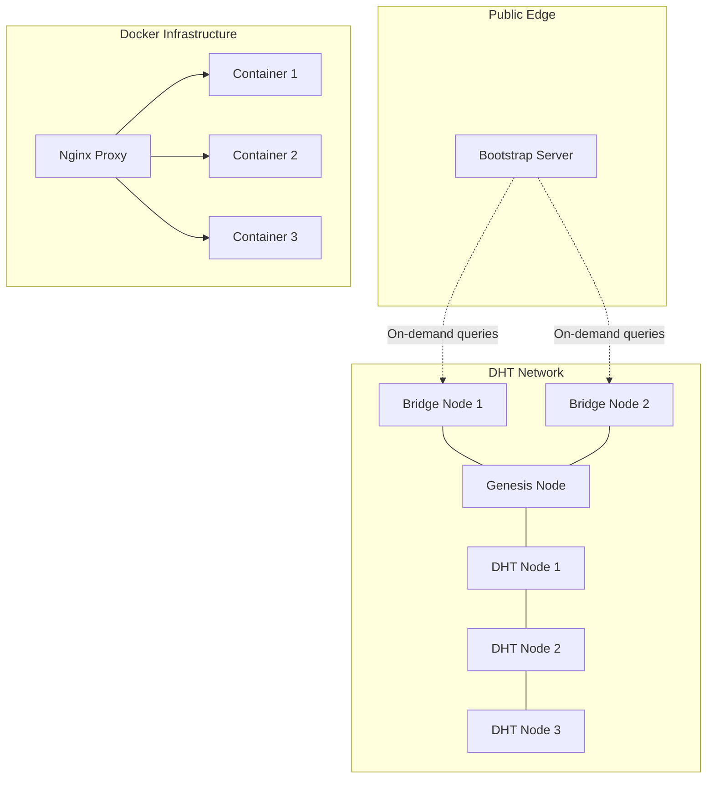

# DHT Connection Recovery Design Document

## Overview

The DHT Connection Recovery system addresses critical connection failures in the YZ Network DHT by implementing a comprehensive recovery architecture. The system coordinates connections through a stateless bootstrap server that works with passive bridge nodes, implements strategic routing table maintenance, and provides robust error handling with fast failure mechanisms.

The design emphasizes security through stateless interactions, performance through optimized data republishing, and reliability through multiple recovery mechanisms including Perfect Negotiation for WebRTC conflicts and differentiated timeout strategies.

## Architecture

### High-Level Architecture



### Component Interaction Flow

```mermaid
sequenceDiagram
    participant NewNode as New DHT Node
    participant BS as Bootstrap Server
    participant BN as Bridge Node
    participant ExistingNode as Existing DHT Node
    
    NewNode->>BS: Request connection coordination
    BS->>BN: Connect & request random peer
    BN-->>BS: Return peer info & disconnect
    BS->>NewNode: Provide peer connection details
    BS->>ExistingNode: Coordinate connection setup
    NewNode<-->ExistingNode: Establish direct connection
    Note over NewNode,ExistingNode: Connection direction depends on node types:<br/>Browser always connects to Node.js<br/>Perfect Negotiation for Node.js ↔ Node.js
```

## Components and Interfaces

### Bootstrap Server

**Purpose**: Public edge server that coordinates DHT connections using stateless interactions with bridge nodes.

**Key Interfaces**:
```javascript
interface BootstrapServer {
  // Connection coordination
  coordinateConnection(requestingNodeId: string): Promise<PeerInfo>
  
  // Bridge node management
  queryBridgeNode(bridgeNodeId: string): Promise<RandomPeerInfo>
  distributeBridgeQueries(): Promise<void>
  
  // Security models
  handleInvitationModel(token: DHT_Token): Promise<ConnectionInfo>
  handleOpenNetwork(nodeId: string): Promise<DHT_Token>
}
```

**Stateless Design**: Connects to bridge nodes on-demand, retrieves information, and disconnects immediately for enhanced security.

### Bridge Nodes

**Purpose**: Special passive DHT nodes that participate in routing but do not handle data storage/retrieval.

**Key Interfaces**:
```javascript
interface BridgeNode extends DHT_Node {
  // Routing participation (inherited)
  handleFindNode(targetId: string): Promise<NodeInfo[]>
  
  // Random peer selection
  getRandomActivePeer(): Promise<PeerInfo>
  
  // Data operations (rejected)
  store(key: string, value: any): Promise<Error> // Always rejects
  get(key: string): Promise<Error> // Always rejects
}
```

### Connection Manager Architecture

**Purpose**: Connection-agnostic superclass with transport-specific subclasses that handle browser/Node.js asymmetry.

```javascript
// Superclass
abstract class ConnectionManager {
  abstract connect(peerId: string): Promise<Connection>
  abstract disconnect(): Promise<void>
  abstract send(message: any): Promise<void>
  abstract onMessage(callback: (message: any) => void): void
  abstract getConnectionState(): ConnectionState
  abstract canAcceptConnections(): boolean  // Browser: false, Node.js: true
}

// Subclasses
class WebRTCConnectionManager extends ConnectionManager {
  // WebRTC-specific implementation for browser-to-browser connections
  // Perfect Negotiation Pattern support
  // STUN server configuration for NAT traversal
  constructor(localNode, remoteNode, stunServers = ['stun:stun.l.google.com:19302']) {
    // Configure ICE servers for NAT traversal
  }
}

class WebSocketConnectionManager extends ConnectionManager {
  // WebSocket-specific implementation
  // Handles browser client → Node.js server pattern
}

// Factory
class ConnectionManagerFactory {
  static create(localNode: NodeInfo, remoteNode: NodeInfo): ConnectionManager {
    // Browser ↔ Node.js: always use WebSocket with Node.js as server
    if (localNode.type === 'browser' && remoteNode.type === 'nodejs') {
      return new WebSocketConnectionManager(localNode, remoteNode, 'client');
    }
    if (localNode.type === 'nodejs' && remoteNode.type === 'browser') {
      return new WebSocketConnectionManager(localNode, remoteNode, 'server');
    }
    // Browser ↔ Browser: use WebRTC with Perfect Negotiation
    if (localNode.type === 'browser' && remoteNode.type === 'browser') {
      return new WebRTCConnectionManager(localNode, remoteNode);
    }
    // Node.js ↔ Node.js: use WebSocket with Perfect Negotiation for server selection
    return new WebSocketConnectionManager(localNode, remoteNode);
  }
}
```

**Connection Direction Rules**:
- **Browser → Node.js**: Browser always connects as WebSocket client to Node.js server
- **Node.js → Browser**: Node.js sends invitation via overlay/bootstrap, Browser connects back
- **Node.js ↔ Node.js**: Perfect Negotiation determines which Node.js acts as WebSocket server
- **Browser ↔ Browser**: Perfect Negotiation determines connection direction for WebRTC

**Per-Connection Design**: Each connection gets its own ConnectionManager instance. The RoutingTable handles ConnectionManager events and maintains connection-agnostic interfaces.

### Routing Table with Strategic Maintenance

**Purpose**: Maintains optimal peer connections within connection limits.

```javascript
interface RoutingTable {
  // Strategic connection management
  prioritizeNeighborhoodConnections(): Promise<void>
  queryKClosestToSelf(): Promise<NodeInfo[]>
  optimizeConnectionDiversity(): Promise<void>
  
  // Disconnected node management
  allowDisconnectedNodes(nodes: NodeInfo[]): void
  pingAndCleanDisconnected(): Promise<void>
  
  // Connection limit management
  dropLessStrategicConnections(count: number): Promise<void>
}
```

### Sticky Pub/Sub Architecture

**Purpose**: Provides persistent message delivery with offline tolerance and historical message access.

**Three-Tier Architecture**:

```javascript
// Tier 1: Coordinator Object (Mutable, <1KB)
interface CoordinatorObject {
  topicID: string;
  version: number;                    // Monotonic version counter
  currentSubscribers: string | null;  // DHT ID of current subscriber collection
  currentMessages: string | null;     // DHT ID of current message collection
  
  // Separate histories for efficient merging
  subscriberHistory: string[];        // Last 10-50 subscriber collection IDs
  messageHistory: string[];           // Last 10-50 message collection IDs
  
  // Linked list for deep history
  previousCoordinator: string | null; // DHT ID of previous coordinator snapshot
  
  createdAt: timestamp;
  lastModified: timestamp;
  state: 'ACTIVE' | 'RECOVERING' | 'FAILED';
}

// Tier 2: Collections (Immutable, Copy-on-Write)
interface MessageCollection {
  collectionID: string;              // Content-based hash
  topicID: string;
  messages: MessageMetadata[];       // Message IDs with metadata
  version: number;                   // Coordinator version when created
  expiresAt: timestamp;              // Content-based TTL
}

interface SubscriberCollection {
  collectionID: string;
  topicID: string;
  subscribers: SubscriberInfo[];
  version: number;
  expiresAt: timestamp;
}

// Tier 3: Individual Messages (Immutable, Encrypted)
interface Message {
  messageID: string;
  topicID: string;
  publisherID: string;
  publisherSequence: number;         // Per-publisher sequence for drop detection
  addedInVersion: number;            // Coordinator version when added
  data: any;                         // Can be encrypted by application
  publishedAt: timestamp;
  expiresAt: timestamp;
  signature: string;                 // Ed25519 signature
}
```

**Key Design Principles**:
- **Immutable Collections**: Copy-on-write prevents race conditions
- **Optimistic Concurrency**: Version-based conflict resolution with automatic merge
- **Message Persistence**: All messages stored with configurable TTL
- **Historical Delivery**: New subscribers receive all non-expired messages
- **Push + Polling**: Hybrid delivery for reliability and performance
- **Lazy Garbage Collection**: Cleanup during normal operations

## Data Models

### Node Information
```javascript
interface NodeInfo {
  id: string;              // DHT node ID
  address: string;         // External proxy address (e.g., imeyouwe.com/node1)
  port: number;
  type: 'browser' | 'nodejs';  // Node type determines connection capabilities
  capabilities: string[];  // ['webrtc', 'websocket', 'bridge']
  canAcceptConnections: boolean;  // Browser: false, Node.js: true
  lastSeen: timestamp;
  connectionState: 'connected' | 'disconnected' | 'connecting';
}
```

### Connection Metadata
```javascript
interface ConnectionMetadata {
  peerId: string;
  connectionType: 'webrtc' | 'websocket';
  establishedAt: timestamp;
  lastActivity: timestamp;
  strategicValue: number;  // For connection prioritization
  isNeighborhood: boolean; // Is this a k-closest neighbor?
}
```

### Storage Metadata (for Republishing)
```javascript
interface StorageEntry {
  // Replicated data
  key: string;
  value: any;
  
  // Local metadata (never replicated)
  receivedAt: timestamp;
  lastRefreshedAt: timestamp;
  myRefreshTime: timestamp;
  ttl: number;
  hash: string;            // SHA-256 for lightweight verification
  originatedByMe: boolean;
}
```

### Error Codes
```javascript
enum DHT_ErrorCode {
  RATE_LIMITED = 'RATE_LIMITED',
  ALREADY_PROCESSED = 'ALREADY_PROCESSED',
  TIMEOUT = 'TIMEOUT',
  CONNECTION_REFUSED = 'REFUSED',
  UNREACHABLE = 'UNREACHABLE',
  BRIDGE_UNAVAILABLE = 'BRIDGE_UNAVAILABLE',
  INVALID_TOKEN = 'INVALID_TOKEN'
}

interface DHT_Error {
  code: DHT_ErrorCode;
  message: string;
  retryAfter?: number;     // For rate limiting
  details?: any;
}
```
## Correctness Properties

*A property is a characteristic or behavior that should hold true across all valid executions of a system-essentially, a formal statement about what the system should do. Properties serve as the bridge between human-readable specifications and machine-verifiable correctness guarantees.*

### Connection Establishment Properties

**Property 1: Startup Connection Success**
*For any* new DHT node starting up, the node should successfully establish connections to at least 3 existing peers within the 30-second timeout window
**Validates: Requirements 1.1**

**Property 2: Connection Loss Recovery**
*For any* DHT node that loses all connections, the node should automatically reconnect to the network within 60 seconds using bootstrap coordination
**Validates: Requirements 1.3**

**Property 3: Exponential Backoff Retry**
*For any* connection attempt that fails, the node should retry with exponential backoff pattern up to exactly 5 attempts before giving up
**Validates: Requirements 1.4**

**Property 4: NAT Traversal Coordination**
*For any* nodes behind NAT/firewall, the system should successfully coordinate connections using appropriate NAT traversal mechanisms: bootstrap server coordination for WebSocket connections and STUN servers for WebRTC peer-to-peer connectivity
**Validates: Requirements 1.5**

### Error Handling and Diagnostics Properties

**Property 5: Connection Failure Logging**
*For any* connection failure that occurs, the DHT node should log detailed error information including peer IDs and specific failure reasons
**Validates: Requirements 2.1**

**Property 6: Fast Failure with Error Codes**
*For any* peer that cannot fulfill a request, the node should respond with specific error codes (RATE_LIMITED, ALREADY_PROCESSED, etc.) instead of timing out
**Validates: Requirements 12.1**

**Property 7: Differentiated Timeouts**
*For any* DHT query, the node should use 10-second timeouts for connected peers and 3-second timeouts for disconnected peers
**Validates: Requirements 12.5**

### Rate Limiting Properties

**Property 8: Legitimate Discovery Allowance**
*For any* legitimate peer discovery operation, the rate limiter should allow sufficient find_node requests for successful network formation
**Validates: Requirements 3.1**

**Property 9: Rate Limit Queuing**
*For any* request blocked by rate limiting, the node should queue the request and retry with appropriate delays rather than dropping it
**Validates: Requirements 3.5**

### Connection State Management Properties

**Property 10: Immediate Routing Table Updates**
*For any* peer connection that is established, the connection manager should update the routing table immediately without delay
**Validates: Requirements 4.1**

**Property 11: Timely Disconnection Cleanup**
*For any* peer that disconnects, the connection manager should remove the peer from active connection lists within 5 seconds
**Validates: Requirements 4.2**

### Bridge Node Properties

**Property 12: Bridge Node Data Rejection**
*For any* data storage operation sent to a bridge node, the bridge node should reject the operation while still handling find_node and routing operations
**Validates: Requirements 5.4**

**Property 13: Stateless Bootstrap Interactions**
*For any* bootstrap server query to a bridge node, the bootstrap server should disconnect from the bridge node immediately after receiving the response
**Validates: Requirements 11.2**

### Docker Networking Properties

**Property 14: External Address Advertisement**
*For any* node advertising its connection address, the node should always advertise the external nginx proxy address rather than internal container addresses
**Validates: Requirements 6.1**

**Property 15: Proxy Connection Handling**
*For any* connection from nginx proxy, the DHT node should accept connections with proper WebSocket upgrade headers regardless of source (internal/external)
**Validates: Requirements 6.3**

### Network Recovery Properties

**Property 16: Bootstrap Fallback**
*For any* node that loses all connections, the node should automatically attempt bootstrap reconnection as the primary recovery mechanism
**Validates: Requirements 7.1**

**Property 17: Partition Healing**
*For any* network partition that heals, nodes should automatically merge back into the main network without manual intervention
**Validates: Requirements 7.5**

### Mesh Topology Properties

**Property 18: Peer Announcement Propagation**
*For any* new peer joining via invitation, the DHT node should announce the new peer to existing network members for mesh formation
**Validates: Requirements 8.1**

**Property 19: Minimum Connectivity**
*For any* completed peer discovery process, the DHT node should have direct connections to at least 3 other peers
**Validates: Requirements 8.5**

### WebRTC Perfect Negotiation Properties

**Property 20: Perfect Negotiation Conflict Resolution**
*For any* two nodes of the same type attempting simultaneous connections (Browser ↔ Browser WebRTC or Node.js ↔ Node.js WebSocket), the system should use Perfect Negotiation Pattern to resolve conflicts deterministically
**Validates: Requirements 9.1**

**Property 21: Browser-NodeJS Connection Direction**
*For any* connection between a browser node and Node.js node, the browser should always connect as WebSocket client to the Node.js server regardless of who initiated the connection
**Validates: Requirements 9.2**

**Property 22: Perfect Negotiation Polite Peer**
*For any* Perfect Negotiation conflict (Browser ↔ Browser WebRTC or Node.js ↔ Node.js WebSocket), the node with the lexicographically smaller node ID should act as "polite" peer and drop its connection attempt
**Validates: Requirements 9.3**

### Strategic Routing Properties

**Property 23: Neighborhood Connection Priority**
*For any* connection management within limits, the node should prioritize connections to nodes closest to its own address for optimal neighborhood connectivity
**Validates: Requirements 10.1**

**Property 24: Disconnected Node Retention with Connected Preference**
*For any* routing table maintenance, the node should allow disconnected nodes to remain in the routing table for fallback discovery, but findNode queries should prefer connected nodes over disconnected nodes when both are available
**Validates: Requirements 10.4**

### Data Republishing Properties

**Property 25: Randomized Republishing Timing**
*For any* data stored in the DHT, the node should schedule automatic republishing using randomized timing with spread window to prevent simultaneous republishing by multiple nodes
**Validates: Requirements 13.1**

**Property 26: Delegated Replication Optimization**
*For any* republishing operation, the node should use delegated replication by finding the closest node and delegating k-node distribution to minimize network probes
**Validates: Requirements 13.2**

**Property 27: Lightweight Verification**
*For any* delegated replication operation, the node should use hash comparison before transferring full data to reduce bandwidth usage
**Validates: Requirements 13.3**

### Pub/Sub Garbage Collection Properties

**Property 28: Message Expiration Cleanup**
*For any* Pub/Sub messages that expire, the node should automatically remove expired messages from collections
**Validates: Requirements 14.1**

**Property 29: Coordinator Cleanup Conditions**
*For any* coordinator with no active subscribers AND no unexpired messages, the node should mark the topic as inactive and schedule cleanup
**Validates: Requirements 14.4**

### Encryption Properties

**Property 30: Automatic Data Encryption**
*For any* data stored in the DHT, the node should automatically encrypt data using AES-256-GCM before transmission
**Validates: Requirements 15.1**

**Property 31: Tampering Detection**
*For any* encrypted data that has been tampered with, the node should detect tampering through signature verification and reject invalid data
**Validates: Requirements 15.4**

### Pub/Sub Properties

**Property 32: Message Persistence**
*For any* message published to a topic, the message should be stored persistently in the DHT with the specified TTL and remain available for retrieval
**Validates: Requirements 16.1**

**Property 33: Historical Message Delivery**
*For any* new subscriber to a topic, the subscriber should receive all non-expired historical messages that were published before subscription
**Validates: Requirements 16.2**

**Property 34: Optimistic Concurrency Handling**
*For any* concurrent publishing operations to the same topic, the system should automatically merge conflicting coordinator updates without message loss
**Validates: Requirements 16.3**

**Property 35: Push Delivery Performance**
*For any* message published to a topic with active subscribers, the system should attempt push delivery and achieve sub-100ms latency when successful
**Validates: Requirements 17.5**

**Property 36: Inactive Tab Exclusion**
*For any* push delivery coordination, the system should exclude inactive browser tabs from coordinator selection to prevent delivery failures
**Validates: Requirements 17.4**

**Property 37: Message Expiration Cleanup**
*For any* messages that exceed their TTL, the system should automatically remove them from message collections during normal operations
**Validates: Requirements 18.1**

**Property 38: Subscription Expiration Cleanup**
*For any* subscriptions that exceed their TTL, the system should automatically remove them from subscriber collections during normal operations
**Validates: Requirements 18.2**

**Property 39: Cryptographic Message Signing**
*For any* message published to a topic, the message should be signed with Ed25519 cryptographic signature using the publisher's private key
**Validates: Requirements 19.1**

**Property 40: Signature-Based Subscription Renewal**
*For any* subscription renewal request, the system should verify the cryptographic signature and timestamp to prevent unauthorized renewals
**Validates: Requirements 19.3**

## Error Handling

### Error Classification System

The system implements a comprehensive error classification with specific error codes for fast failure:

```javascript
enum DHT_ErrorCode {
  // Rate limiting errors
  RATE_LIMITED = 'RATE_LIMITED',
  
  // Request processing errors  
  ALREADY_PROCESSED = 'ALREADY_PROCESSED',
  INVALID_REQUEST = 'INVALID_REQUEST',
  
  // Connection errors
  TIMEOUT = 'TIMEOUT',
  CONNECTION_REFUSED = 'REFUSED', 
  UNREACHABLE = 'UNREACHABLE',
  
  // Bootstrap/Bridge errors
  BRIDGE_UNAVAILABLE = 'BRIDGE_UNAVAILABLE',
  BOOTSTRAP_FAILED = 'BOOTSTRAP_FAILED',
  
  // Security errors
  INVALID_TOKEN = 'INVALID_TOKEN',
  UNAUTHORIZED = 'UNAUTHORIZED'
}
```

### Differentiated Timeout Strategy

- **Connected Peers**: 10-second timeout for operations with established connections
- **Disconnected Peers**: 3-second timeout for operations requiring new connections
- **Bootstrap Operations**: 30-second timeout for initial network entry
- **Bridge Node Queries**: 5-second timeout for stateless interactions

### Recovery Mechanisms

1. **Connection Loss Recovery**:
   - Automatic bootstrap reconnection when all connections lost
   - Alternative bootstrap endpoint failover
   - DHT routing fallback when partial connectivity exists

2. **Rate Limiting Recovery**:
   - Request queuing with exponential backoff
   - Emergency bypass mechanisms for critical operations
   - Alternative discovery methods during rate limit periods

3. **Network Partition Recovery**:
   - Automatic partition detection through connectivity monitoring
   - Merge protocols for partition healing
   - State reconciliation after network reunification

## Testing Strategy

### Dual Testing Approach

The testing strategy employs both unit testing and property-based testing to ensure comprehensive coverage:

**Unit Testing**:
- Specific examples demonstrating correct behavior
- Integration points between components
- Edge cases and error conditions
- Docker networking configuration scenarios

**Property-Based Testing**:
- Universal properties verified across all valid inputs
- Connection establishment patterns across network topologies
- Rate limiting behavior under various load conditions
- Perfect Negotiation conflict resolution across node ID combinations
- Strategic routing optimization across different network states

### Property-Based Testing Framework

The system uses **fast-check** (JavaScript) for property-based testing with the following configuration:
- Minimum 100 iterations per property test for statistical confidence
- Custom generators for network topologies, node configurations, and message patterns
- Shrinking strategies for minimal failing examples

### Test Categories

1. **Connection Properties**: Test connection establishment, recovery, and maintenance across various network conditions
2. **Error Handling Properties**: Verify fast failure mechanisms and proper error code generation
3. **Rate Limiting Properties**: Test rate limiting behavior under normal and stress conditions
4. **Routing Properties**: Verify strategic routing table maintenance and optimization
5. **Security Properties**: Test encryption, authentication, and Perfect Negotiation patterns
6. **Performance Properties**: Verify delegated replication and lightweight verification optimizations

Each property-based test is tagged with comments explicitly referencing the correctness property from this design document using the format: **Feature: dht-connection-recovery, Property {number}: {property_text}**