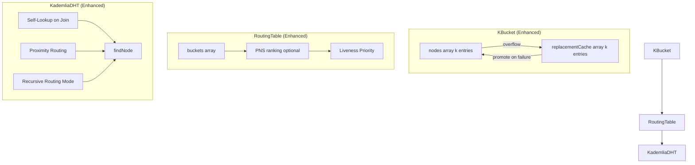

# Design Document: Kademlia Routing Enhancements

## Overview

This design document specifies the technical implementation for six Kademlia DHT enhancements that improve routing efficiency, network resilience, and convergence speed. The enhancements build on the existing infrastructure including RTT tracking (`DHTNode.rtt`, `recordPing()`), liveness checks (`isAlive`, `failureCount`), and XOR distance sorting.

### Key Design Decisions

1. **Replacement caches** are stored per-bucket in `KBucket.js` to maintain prefix diversity
2. **Self-lookup** executes after first bootstrap connection to accelerate routing table population
3. **Proximity routing** uses existing RTT data as a secondary sort key (no additional probes)
4. **Recursive routing** forwards queries autonomously with hop counting and XOR distance verification
5. **PNS** is opt-in and performs limited RTT probes only when enabled
6. **Liveness always wins** - no proximity metric can override a live node

## Architecture



## Components and Interfaces

### 1. KBucket Replacement Cache

**File:** `src/core/KBucket.js`

```javascript
class KBucket {
  constructor(k = 20, prefix = 0, depth = 0) {
    this.k = k;
    this.prefix = prefix;
    this.depth = depth;
    this.nodes = [];
    this.replacementCache = []; // NEW: Secondary storage for overflow nodes
    this.lastUpdated = Date.now();
  }

  // Enhanced addNode with replacement cache support
  addNode(node) {
    // Existing node update logic...
    
    if (this.nodes.length < this.k) {
      // Add to main bucket
      return true;
    }
    
    // Bucket full - add to replacement cache
    return this.addToReplacementCache(node);
  }

  // NEW: Add node to replacement cache
  addToReplacementCache(node) {
    const existingIndex = this.replacementCache.findIndex(n => n.id.equals(node.id));
    
    if (existingIndex !== -1) {
      // Move to end (most recently seen)
      const existing = this.replacementCache.splice(existingIndex, 1)[0];
      existing.lastSeen = Date.now();
      this.replacementCache.push(existing);
      return true;
    }
    
    if (this.replacementCache.length < this.k) {
      node.lastSeen = Date.now();
      this.replacementCache.push(node);
      return true;
    }
    
    // Cache full - evict oldest
    this.replacementCache.shift();
    node.lastSeen = Date.now();
    this.replacementCache.push(node);
    return true;
  }

  // NEW: Promote from replacement cache when bucket member fails
  promoteFromReplacementCache() {
    if (this.replacementCache.length === 0) {
      return null;
    }
    
    // Promote most recently seen node
    const promoted = this.replacementCache.pop();
    promoted.lastSeen = Date.now();
    this.nodes.push(promoted);
    this.lastUpdated = Date.now();
    return promoted;
  }

  // NEW: Handle node failure with replacement cache promotion
  handleNodeFailure(nodeId) {
    const index = this.nodes.findIndex(n => n.id.equals(nodeId));
    if (index === -1) return false;
    
    this.nodes.splice(index, 1);
    const promoted = this.promoteFromReplacementCache();
    
    if (promoted) {
      console.log(`📋 Promoted ${promoted.id.toString().substring(0, 8)}... from replacement cache`);
    }
    
    this.lastUpdated = Date.now();
    return true;
  }

  // NEW: Get replacement cache contents
  getReplacementCache() {
    return [...this.replacementCache];
  }

  // NEW: Get replacement cache size
  replacementCacheSize() {
    return this.replacementCache.length;
  }
}
```

### 2. Self-Lookup on Node Join

**File:** `src/dht/KademliaDHT.js`

```javascript
class KademliaDHT {
  constructor(options = {}) {
    // ... existing constructor ...
    this.selfLookupComplete = false;
    this.selfLookupRetries = 0;
    this.maxSelfLookupRetries = 3;
  }

  async start() {
    // ... existing start logic ...
    
    // After bootstrap connection established
    if (this.getConnectedPeers().length > 0) {
      this.performSelfLookup();
    }
  }

  // NEW: Perform self-lookup to populate nearby buckets
  async performSelfLookup() {
    if (this.selfLookupComplete) return;
    
    console.log(`🔍 Performing self-lookup for ${this.localNodeId.toString().substring(0, 8)}...`);
    
    try {
      const discoveredNodes = await this.findNode(this.localNodeId, {
        timeout: 15000,
        allowRouting: true
      });
      
      console.log(`✅ Self-lookup discovered ${discoveredNodes.length} nearby nodes`);
      
      // Add all discovered nodes to routing table
      for (const node of discoveredNodes) {
        if (!node.id.equals(this.localNodeId)) {
          this.routingTable.addNode(node);
        }
      }
      
      this.selfLookupComplete = true;
      this.emit('selfLookupComplete', { nodesDiscovered: discoveredNodes.length });
      
    } catch (error) {
      console.warn(`⚠️ Self-lookup failed: ${error.message}`);
      this.selfLookupRetries++;
      
      if (this.selfLookupRetries < this.maxSelfLookupRetries) {
        const backoff = Math.pow(2, this.selfLookupRetries) * 1000;
        console.log(`🔄 Retrying self-lookup in ${backoff}ms (attempt ${this.selfLookupRetries + 1}/${this.maxSelfLookupRetries})`);
        setTimeout(() => this.performSelfLookup(), backoff);
      } else {
        console.error(`❌ Self-lookup failed after ${this.maxSelfLookupRetries} retries`);
        this.emit('selfLookupComplete', { nodesDiscovered: 0, failed: true });
      }
    }
  }
}
```

### 3. Proximity Routing

**File:** `src/dht/KademliaDHT.js`

```javascript
class KademliaDHT {
  // NEW: Select next hop using RTT as secondary criterion
  selectNextHopWithProximity(candidates, targetId) {
    const target = targetId instanceof DHTNodeId ? targetId : DHTNodeId.fromHex(targetId);
    const localDistance = this.localNodeId.xorDistance(target);
    
    // Filter to candidates that reduce XOR distance
    const xorValidCandidates = candidates.filter(node => {
      const candidateDistance = node.id.xorDistance(target);
      return candidateDistance.compare(localDistance) < 0;
    });
    
    if (xorValidCandidates.length === 0) {
      return null; // No valid candidates
    }
    
    if (xorValidCandidates.length === 1) {
      return xorValidCandidates[0];
    }
    
    // Calculate average RTT for nodes without RTT data
    const nodesWithRTT = xorValidCandidates.filter(n => n.rtt > 0);
    const avgRTT = nodesWithRTT.length > 0
      ? nodesWithRTT.reduce((sum, n) => sum + n.rtt, 0) / nodesWithRTT.length
      : 100; // Default 100ms if no RTT data
    
    // Sort by XOR distance first, then by RTT
    xorValidCandidates.sort((a, b) => {
      const distA = a.id.xorDistance(target);
      const distB = b.id.xorDistance(target);
      const distCompare = distA.compare(distB);
      
      if (distCompare !== 0) {
        return distCompare; // Primary: XOR distance
      }
      
      // Secondary: RTT (use avgRTT for nodes without data)
      const rttA = a.rtt > 0 ? a.rtt : avgRTT;
      const rttB = b.rtt > 0 ? b.rtt : avgRTT;
      return rttA - rttB;
    });
    
    return xorValidCandidates[0];
  }

  // Enhanced findNode with proximity routing
  async findNode(targetId, options = {}) {
    // ... existing setup ...
    
    // When selecting candidates, use proximity routing
    const candidates = this.selectNextHopWithProximity(
      Array.from(results).filter(n => !contacted.has(n.id.toString())),
      target
    );
    
    // ... rest of findNode ...
  }
}
```

### 4. Recursive Routing Mode

**File:** `src/dht/KademliaDHT.js`

```javascript
class KademliaDHT {
  constructor(options = {}) {
    // ... existing constructor ...
    this.routingMode = options.routingMode || 'recursive'; // 'iterative' or 'recursive'
    this.maxRecursiveHops = 20;
  }

  // NEW: Handle recursive find_node request
  async handleRecursiveFindNode(peerId, message, sourceManager = null) {
    const { target, requestId, hopCount = 0, originatorId } = message;
    const targetId = DHTNodeId.fromString(target);
    
    console.log(`🔄 Recursive find_node: hop ${hopCount}, target ${target.substring(0, 8)}...`);
    
    // Check hop limit
    if (hopCount >= this.maxRecursiveHops) {
      console.warn(`⚠️ Recursive find_node exceeded max hops (${this.maxRecursiveHops})`);
      return this.sendRecursiveResponse(originatorId, requestId, [], peerId);
    }
    
    // Find closest nodes we know
    const closestNodes = this.routingTable.findClosestNodes(targetId, this.options.k);
    
    // Check if we can forward to a closer peer
    const localDistance = this.localNodeId.xorDistance(targetId);
    const closerPeers = closestNodes.filter(node => {
      const nodeDistance = node.id.xorDistance(targetId);
      return nodeDistance.compare(localDistance) < 0 && this.isPeerConnected(node.id.toString());
    });
    
    if (closerPeers.length === 0) {
      // We're the closest - return our known nodes
      console.log(`📍 Recursive find_node: reached closest node, returning ${closestNodes.length} nodes`);
      return this.sendRecursiveResponse(originatorId, requestId, closestNodes, peerId);
    }
    
    // Forward to closest peer with proximity selection
    const nextHop = this.selectNextHopWithProximity(closerPeers, targetId);
    
    if (!nextHop) {
      return this.sendRecursiveResponse(originatorId, requestId, closestNodes, peerId);
    }
    
    // Verify XOR distance strictly decreases
    const nextHopDistance = nextHop.id.xorDistance(targetId);
    if (nextHopDistance.compare(localDistance) >= 0) {
      console.warn(`⚠️ XOR distance not decreasing - stopping recursion`);
      return this.sendRecursiveResponse(originatorId, requestId, closestNodes, peerId);
    }
    
    console.log(`🔀 Forwarding recursive find_node to ${nextHop.id.toString().substring(0, 8)}... (hop ${hopCount + 1})`);
    
    // Forward the request
    const forwardMessage = {
      type: 'recursive_find_node',
      requestId,
      target,
      originatorId: originatorId || peerId,
      hopCount: hopCount + 1,
      nodeId: this.localNodeId.toString()
    };
    
    await this.sendMessage(nextHop.id.toString(), forwardMessage);
  }

  // NEW: Send recursive response back to originator
  async sendRecursiveResponse(originatorId, requestId, nodes, lastHopId) {
    const response = {
      type: 'recursive_find_node_response',
      requestId,
      nodes: nodes.map(n => n.toCompact()),
      lastHopId: this.localNodeId.toString()
    };
    
    if (this.isPeerConnected(originatorId)) {
      await this.sendMessage(originatorId, response);
    } else if (this.overlayNetwork) {
      await this.overlayNetwork.sendViaRouting(originatorId, response);
    }
  }

  // Enhanced handlePeerMessage to route recursive messages
  async handlePeerMessage(peerId, message, sourceManager = null) {
    // ... existing message handling ...
    
    switch (message.type) {
      case 'recursive_find_node':
        await this.handleRecursiveFindNode(peerId, message, sourceManager);
        break;
      case 'recursive_find_node_response':
        await this.handleRecursiveFindNodeResponse(peerId, message);
        break;
      // ... other cases ...
    }
  }
}
```

### 5. Proximity Neighbor Selection (Optional)

**File:** `src/dht/RoutingTable.js`

```javascript
class RoutingTable {
  constructor(localNodeId, k = 20, options = {}) {
    // ... existing constructor ...
    this.pnsEnabled = options.pnsEnabled || false;
    this.pnsProbeInterval = options.pnsProbeInterval || 60000; // 1 minute
  }

  // NEW: Rank bucket entries by RTT when PNS is enabled
  rankBucketByRTT(bucketIndex) {
    if (!this.pnsEnabled) return;
    
    const bucket = this.buckets[bucketIndex];
    if (!bucket || bucket.nodes.length < 2) return;
    
    // Sort nodes by RTT (lower is better), preserving liveness priority
    bucket.nodes.sort((a, b) => {
      // Liveness always wins
      if (a.isAlive && !b.isAlive) return -1;
      if (!a.isAlive && b.isAlive) return 1;
      
      // Among live nodes, sort by RTT
      const rttA = a.rtt > 0 ? a.rtt : Infinity;
      const rttB = b.rtt > 0 ? b.rtt : Infinity;
      return rttA - rttB;
    });
  }

  // NEW: Perform limited RTT probes for PNS
  async performPNSProbes(pingCallback) {
    if (!this.pnsEnabled) return;
    
    for (let i = 0; i < this.buckets.length; i++) {
      const bucket = this.buckets[i];
      
      // Only probe nodes without recent RTT data
      const nodesToProbe = bucket.nodes.filter(n => 
        n.isAlive && (n.rtt === 0 || Date.now() - n.lastPing > this.pnsProbeInterval)
      );
      
      // Limit probes per bucket to avoid flooding
      const limitedProbes = nodesToProbe.slice(0, 3);
      
      for (const node of limitedProbes) {
        try {
          await pingCallback(node.id.toString());
        } catch (error) {
          // Probe failed - don't update RTT
        }
      }
      
      // Re-rank after probes
      this.rankBucketByRTT(i);
    }
  }

  // Enhanced addNode with PNS consideration
  addNode(node) {
    const result = this._originalAddNode(node); // Call existing logic
    
    if (result && this.pnsEnabled) {
      const bucketIndex = this.getBucketIndex(node.id);
      this.rankBucketByRTT(bucketIndex);
    }
    
    return result;
  }
}
```

### 6. Liveness Over Proximity Enforcement

**File:** `src/dht/RoutingTable.js`

```javascript
class RoutingTable {
  // Enhanced addNode with liveness priority
  addNode(node) {
    // ... existing validation ...
    
    const bucketIndex = this.getBucketIndex(node.id);
    const bucket = this.buckets[bucketIndex];
    
    // Try to add to existing bucket
    if (bucket.addNode(node)) {
      return true;
    }
    
    // Bucket is full - check replacement cache first
    if (bucket.replacementCache && bucket.replacementCache.length > 0) {
      // Don't evict live nodes for new nodes
      const leastRecent = bucket.getLeastRecentlySeenNode();
      
      if (leastRecent && !this.isNodeLive(leastRecent)) {
        // Evict dead node, promote from cache
        bucket.handleNodeFailure(leastRecent.id);
        return bucket.addNode(node);
      }
    }
    
    // Can't add - all nodes are live
    // Add to replacement cache instead
    return bucket.addToReplacementCache(node);
  }

  // NEW: Check if node is considered live
  isNodeLive(node) {
    // Node is live if:
    // 1. isAlive flag is true, AND
    // 2. Has responded within the last ping interval
    const pingInterval = 5 * 60 * 1000; // 5 minutes
    return node.isAlive && (Date.now() - node.lastSeen) < pingInterval;
  }

  // NEW: Never replace live node with better-RTT unknown-liveness node
  shouldReplaceNode(existingNode, candidateNode) {
    // Rule 1: Never replace a live node with unknown liveness
    if (this.isNodeLive(existingNode) && !candidateNode.isAlive) {
      return false;
    }
    
    // Rule 2: Never replace recently-seen node regardless of RTT
    const pingInterval = 5 * 60 * 1000;
    if ((Date.now() - existingNode.lastSeen) < pingInterval) {
      return false;
    }
    
    // Rule 3: Only replace if existing node has failed liveness
    return !existingNode.isAlive || existingNode.failureCount >= 3;
  }
}
```

## Data Models

### Enhanced KBucket State

```javascript
{
  k: 20,
  prefix: 0,
  depth: 0,
  nodes: [DHTNode, ...],           // Main bucket (max k entries)
  replacementCache: [DHTNode, ...], // Overflow storage (max k entries)
  lastUpdated: timestamp
}
```

### Recursive Find Node Message

```javascript
{
  type: 'recursive_find_node',
  requestId: string,
  target: string,           // Target node ID (hex)
  originatorId: string,     // Original requester's node ID
  hopCount: number,         // Current hop count (0-20)
  nodeId: string            // Sender's node ID
}
```

### Recursive Find Node Response

```javascript
{
  type: 'recursive_find_node_response',
  requestId: string,
  nodes: [CompactNode, ...], // Closest nodes found
  lastHopId: string          // Node that generated the response
}
```

### Configuration Options

```javascript
{
  routingMode: 'recursive' | 'iterative',  // Default: 'recursive'
  pnsEnabled: boolean,                      // Default: false
  maxRecursiveHops: number,                 // Default: 20
  pnsProbeInterval: number                  // Default: 60000 (1 minute)
}
```


## Correctness Properties

*A property is a characteristic or behavior that should hold true across all valid executions of a system—essentially, a formal statement about what the system should do. Properties serve as the bridge between human-readable specifications and machine-verifiable correctness guarantees.*

### Property 1: Replacement Cache Overflow Storage

*For any* full KBucket (containing k nodes) and any new node to be added, the new node SHALL appear in the replacement cache after the add operation.

**Validates: Requirements 1.1**

### Property 2: Replacement Cache Size Invariant

*For any* KBucket after any sequence of add operations, the replacement cache size SHALL never exceed k entries.

**Validates: Requirements 1.2**

### Property 3: Replacement Cache Promotion on Failure

*For any* KBucket with a non-empty replacement cache, when a bucket member fails liveness checks, the most recently seen node from the cache SHALL be promoted to the main bucket AND removed from the replacement cache.

**Validates: Requirements 1.3, 1.4**

### Property 4: Replacement Cache LRU Ordering

*For any* replacement cache containing a node N, when N is seen again (re-added), N SHALL be moved to the end of the cache (most recently seen position).

**Validates: Requirements 1.5**

### Property 5: Replacement Cache Prefix Isolation

*For any* KBucket with prefix P and depth D, all nodes in its replacement cache SHALL have XOR distances that place them within the bucket's prefix range.

**Validates: Requirements 1.6**

### Property 6: Self-Lookup Populates Routing Table

*For any* set of nodes returned by a self-lookup operation, all returned nodes (except the local node) SHALL be present in the routing table after the operation completes.

**Validates: Requirements 2.3**

### Property 7: XOR Distance Filtering in Proximity Routing

*For any* set of candidate nodes and target ID, the selected next-hop candidate SHALL have a smaller XOR distance to the target than the local node.

**Validates: Requirements 3.1**

### Property 8: RTT Tie-Breaking Among XOR-Equivalent Candidates

*For any* set of candidates with equal XOR distance to a target, the candidate with the lowest RTT SHALL be selected as the next hop.

**Validates: Requirements 3.2**

### Property 9: Default RTT for Unknown Nodes

*For any* candidate without RTT data (rtt === 0), the selection algorithm SHALL treat it as having the average RTT of all candidates with known RTT values.

**Validates: Requirements 3.4**

### Property 10: XOR Distance Supremacy Over RTT

*For any* candidate selection where a non-XOR-reducing candidate has better RTT than all XOR-reducing candidates, the XOR-reducing candidate SHALL still be selected.

**Validates: Requirements 3.5**

### Property 11: Recursive Forwarding to Closer Peers

*For any* recursive find_node request received by a node, if a connected peer exists with smaller XOR distance to the target, the request SHALL be forwarded to that peer.

**Validates: Requirements 4.2**

### Property 12: Strict XOR Distance Reduction in Recursive Routing

*For any* recursive query forwarding, the next hop's XOR distance to the target SHALL be strictly less than the current node's XOR distance.

**Validates: Requirements 4.3**

### Property 13: Hop Counter Presence

*For any* recursive find_node message, the message SHALL contain a hopCount field with a non-negative integer value.

**Validates: Requirements 4.4**

### Property 14: Maximum Hop Limit Enforcement

*For any* recursive find_node request with hopCount >= 20, the request SHALL NOT be forwarded and SHALL return the closest known nodes instead.

**Validates: Requirements 4.5**

### Property 15: Recursive Termination Response

*For any* recursive query that reaches a node with no closer connected peers, the node SHALL return its closest known nodes to the originator.

**Validates: Requirements 4.6**

### Property 16: PNS Bucket RTT Ordering

*For any* KBucket when PNS is enabled, the nodes array SHALL be ordered by RTT (ascending) among nodes with equal liveness status.

**Validates: Requirements 5.1**

### Property 17: Bucket Structure Immutability Under Proximity

*For any* sequence of operations involving RTT updates or PNS ranking, the number of buckets and their prefix/depth values SHALL remain unchanged.

**Validates: Requirements 5.3, 6.5**

### Property 18: XOR Distance Priority Over RTT in Replacement

*For any* node replacement decision, a node with worse XOR distance SHALL NOT replace a node with better XOR distance, regardless of RTT values.

**Validates: Requirements 5.4**

### Property 19: Liveness Priority Over RTT in Eviction

*For any* eviction decision between a live node and a dead node, the dead node SHALL be evicted regardless of RTT comparison.

**Validates: Requirements 6.1**

### Property 20: Live Node Protection from Unknown-Liveness Replacement

*For any* replacement candidate with unknown liveness (isAlive === false or never pinged), the candidate SHALL NOT replace a live node regardless of RTT.

**Validates: Requirements 6.2**

### Property 21: Recently-Seen Node Protection

*For any* node that has responded within the last ping interval (5 minutes), the node SHALL NOT be replaced regardless of RTT comparison with candidates.

**Validates: Requirements 6.3**

### Property 22: Cache Promotion Priority Over New Nodes

*For any* node failure in a bucket with a non-empty replacement cache, the cache promotion SHALL occur before any new node is accepted into the main bucket.

**Validates: Requirements 6.4**

## Error Handling

### Replacement Cache Errors

| Error Condition | Handling Strategy |
|-----------------|-------------------|
| Promotion from empty cache | Return null, log warning, allow new node addition |
| Cache corruption (invalid nodes) | Skip invalid entries, continue with valid ones |
| Bucket index out of bounds | Log error, return false for add operation |

### Self-Lookup Errors

| Error Condition | Handling Strategy |
|-----------------|-------------------|
| Network timeout | Retry with exponential backoff (1s, 2s, 4s) |
| No bootstrap peers | Emit 'selfLookupComplete' with failed=true |
| All retries exhausted | Log error, continue without self-lookup |

### Proximity Routing Errors

| Error Condition | Handling Strategy |
|-----------------|-------------------|
| No XOR-valid candidates | Return null, fall back to closest known node |
| All candidates have RTT=0 | Use default 100ms for all, select by XOR distance |
| RTT data stale (>5 min) | Use existing data, schedule background probe |

### Recursive Routing Errors

| Error Condition | Handling Strategy |
|-----------------|-------------------|
| Hop limit exceeded | Return closest known nodes, don't forward |
| Next hop disconnected | Try next closest peer, or return results |
| Originator unreachable | Log warning, discard response |
| XOR distance not decreasing | Stop recursion, return current results |

### PNS Errors

| Error Condition | Handling Strategy |
|-----------------|-------------------|
| Probe timeout | Don't update RTT, keep existing value |
| Probe failure | Record failure, don't affect bucket ranking |
| Invalid RTT value | Ignore, use default average |

## Testing Strategy

### Property-Based Testing Configuration

- **Library:** fast-check (JavaScript property-based testing)
- **Minimum iterations:** 100 per property test
- **Tag format:** `Feature: kademlia-routing-enhancements, Property {N}: {description}`

### Test Categories

#### Unit Tests (Specific Examples)

1. **Self-lookup startup sequence** - Verify self-lookup triggers after bootstrap (Req 2.1, 2.2)
2. **Self-lookup event emission** - Verify 'selfLookupComplete' event fires (Req 2.4)
3. **Self-lookup retry behavior** - Verify 3 retries with exponential backoff (Req 2.5)
4. **Recursive routing configuration** - Verify routingMode option works (Req 4.7)
5. **Recursive routing default** - Verify default is 'recursive' (Req 4.8)
6. **PNS default disabled** - Verify pnsEnabled defaults to false (Req 5.5)
7. **PNS configuration option** - Verify pnsEnabled option works (Req 5.6)
8. **PNS probe behavior** - Verify limited probes are sent (Req 5.2)

#### Property Tests (Universal Properties)

Each correctness property (1-22) maps to a property-based test:

```javascript
// Example: Property 1 - Replacement Cache Overflow Storage
describe('KBucket Replacement Cache', () => {
  it('Property 1: overflow nodes go to replacement cache', () => {
    fc.assert(
      fc.property(
        fc.array(arbitraryDHTNode(), { minLength: 21, maxLength: 30 }),
        (nodes) => {
          // Feature: kademlia-routing-enhancements, Property 1: Replacement Cache Overflow Storage
          const bucket = new KBucket(20);
          
          // Add k nodes to fill bucket
          for (let i = 0; i < 20; i++) {
            bucket.addNode(nodes[i]);
          }
          
          // Add overflow node
          const overflowNode = nodes[20];
          bucket.addNode(overflowNode);
          
          // Verify overflow node is in replacement cache
          const cache = bucket.getReplacementCache();
          return cache.some(n => n.id.equals(overflowNode.id));
        }
      ),
      { numRuns: 100 }
    );
  });
});
```

### Test File Organization

```
test/
├── core/
│   └── KBucket.property.test.js      # Properties 1-5
├── dht/
│   ├── SelfLookup.test.js            # Property 6 + unit tests
│   ├── ProximityRouting.property.test.js  # Properties 7-10
│   ├── RecursiveRouting.property.test.js  # Properties 11-15
│   └── RoutingTable.property.test.js      # Properties 16-22
```

### Generators Required

```javascript
// Arbitrary DHTNode with configurable RTT and liveness
const arbitraryDHTNode = () => fc.record({
  id: fc.hexaString({ minLength: 40, maxLength: 40 }),
  rtt: fc.nat({ max: 1000 }),
  isAlive: fc.boolean(),
  lastSeen: fc.nat(),
  failureCount: fc.nat({ max: 5 })
}).map(data => {
  const node = new DHTNode(data.id);
  node.rtt = data.rtt;
  node.isAlive = data.isAlive;
  node.lastSeen = Date.now() - data.lastSeen;
  node.failureCount = data.failureCount;
  return node;
});

// Arbitrary KBucket with configurable fill level
const arbitraryKBucket = (fillLevel = 'full') => fc.record({
  k: fc.constant(20),
  nodes: fc.array(arbitraryDHTNode(), { 
    minLength: fillLevel === 'full' ? 20 : 0,
    maxLength: 20 
  }),
  cache: fc.array(arbitraryDHTNode(), { maxLength: 20 })
});
```

### Integration Tests

1. **End-to-end recursive routing** - Multi-node network with recursive queries
2. **Self-lookup network convergence** - Verify routing table population across nodes
3. **Replacement cache under churn** - Simulate node failures and verify promotions
4. **PNS ranking stability** - Verify bucket ordering under RTT updates
