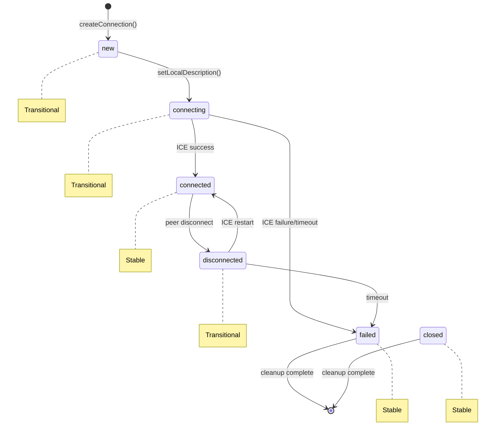
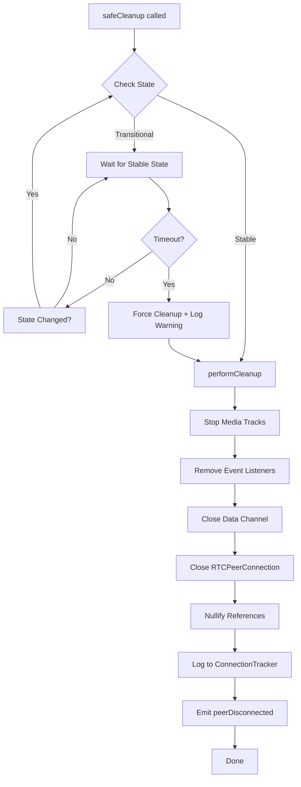
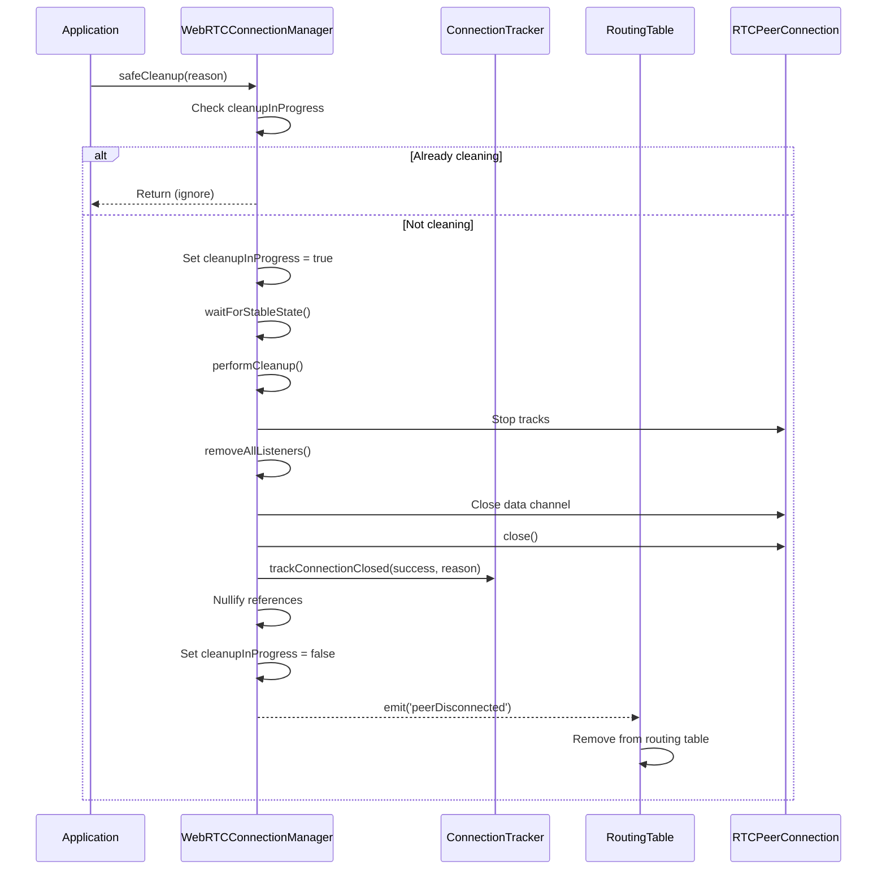

# Design Document: WebRTC Resource Cleanup

## Overview

This design addresses the critical issue of WebRTC resource leaks in the YZ Network. The current implementation performs basic cleanup (calling `pc.close()` and deleting map entries) without considering connection state, cleanup order, or proper resource release. This leads to accumulated UDP sockets and file descriptors over time (observed: 500+ UDP sockets, 2000+ file descriptors after 9 hours of operation).

The enhanced cleanup system introduces:
- **State-aware cleanup**: Wait for stable connection states before cleanup to avoid interfering with ongoing negotiations
- **Ordered cleanup execution**: Release resources in the correct dependency order (tracks → listeners → channel → connection → references)
- **Event listener tracking**: Register and remove all listeners to prevent memory leaks
- **Connection metrics**: Track cleanup success/failure rates for production monitoring
- **Concurrent cleanup prevention**: Ignore duplicate cleanup requests to avoid race conditions
- **Routing table integration**: Remove peers from DHT routing on disconnect
- **Complete shutdown cleanup**: Clean all connections when the manager is destroyed

The implementation will modify `WebRTCConnectionManager.js` to add the new cleanup infrastructure while maintaining backward compatibility with existing connection logic.

## Architecture

### Connection State Machine



### Cleanup Flow



### Component Interaction



## Components and Interfaces

### ConnectionStates Utility

Classifies RTCPeerConnection states for cleanup decisions.

```javascript
/**
 * Connection state classification for cleanup decisions
 */
const ConnectionStates = {
  /** States where cleanup is unsafe - connection may still be negotiating */
  TRANSITIONAL: ['new', 'connecting', 'disconnected'],
  
  /** States where cleanup is safe - connection is terminal or stable */
  STABLE: ['connected', 'failed', 'closed'],
  
  /**
   * Check if state is transitional (cleanup should wait)
   * @param {string} state - RTCPeerConnection.connectionState value
   * @returns {boolean}
   */
  isTransitional(state) {
    return this.TRANSITIONAL.includes(state);
  },
  
  /**
   * Check if state is stable (cleanup can proceed)
   * @param {string} state - RTCPeerConnection.connectionState value
   * @returns {boolean}
   */
  isStable(state) {
    return this.STABLE.includes(state);
  }
};
```

### ConnectionTracker Class

Singleton class for monitoring connection lifecycle metrics.

```javascript
/**
 * Tracks WebRTC connection metrics for monitoring and debugging
 * Singleton pattern - shared across all WebRTCConnectionManager instances
 */
class ConnectionTracker {
  /** Number of currently active connections */
  static activeConnections = 0;
  
  /** Number of successful cleanup operations */
  static cleanupSuccesses = 0;
  
  /** Number of failed cleanup operations */
  static cleanupFailures = 0;
  
  /** Detailed cleanup failure logs */
  static failureLogs = [];
  
  /**
   * Track a new connection being established
   */
  static trackConnectionCreated() { }
  
  /**
   * Track a connection being closed
   * @param {boolean} success - Whether cleanup succeeded
   * @param {string} reason - Reason for closure
   * @param {Object} details - Additional details (peerId, state, error)
   */
  static trackConnectionClosed(success, reason, details = {}) { }
  
  /**
   * Get current resource statistics
   * @returns {Object} Stats including active, successes, failures, failureLogs
   */
  static getResourceStats() { }
  
  /**
   * Reset all counters (for testing)
   */
  static reset() { }
}
```

### WebRTCConnectionManager Extensions

New methods added to WebRTCConnectionManager:

```javascript
class WebRTCConnectionManager extends ConnectionManager {
  // New instance properties
  cleanupInProgress = false;
  cleanupTimeout = 5000; // ms
  trackedListeners = []; // Array of {target, event, handler}
  
  /**
   * Register an event listener with automatic tracking for cleanup
   * @param {EventTarget} target - RTCPeerConnection or RTCDataChannel
   * @param {string} event - Event name
   * @param {Function} handler - Event handler function
   */
  registerListener(target, event, handler) { }
  
  /**
   * Remove all tracked event listeners
   */
  removeAllListeners() { }
  
  /**
   * State-aware cleanup entry point
   * @param {string} reason - Reason for cleanup
   * @returns {Promise<void>}
   */
  async safeCleanup(reason) { }
  
  /**
   * Wait for connection to reach a stable state
   * @param {number} timeout - Maximum wait time in ms
   * @returns {Promise<string>} Final state
   */
  async waitForStableState(timeout = this.cleanupTimeout) { }
  
  /**
   * Execute cleanup in correct order
   * @param {string} reason - Reason for cleanup
   */
  performCleanup(reason) { }
  
  /**
   * Stop all media tracks on the peer connection
   */
  stopAllTracks() { }
}
```

### Event Interface

Events emitted during cleanup:

| Event | Payload | Description |
|-------|---------|-------------|
| `peerDisconnected` | `{ peerId, reason }` | Emitted after cleanup completes |
| `cleanupStarted` | `{ peerId, state }` | Emitted when cleanup begins (for debugging) |
| `cleanupCompleted` | `{ peerId, success, reason }` | Emitted when cleanup finishes |

## Data Models

### TrackedListener

Structure for tracking registered event listeners:

```typescript
interface TrackedListener {
  /** The target object (RTCPeerConnection or RTCDataChannel) */
  target: EventTarget;
  /** Event name (e.g., 'connectionstatechange', 'icecandidate') */
  event: string;
  /** The handler function reference */
  handler: Function;
}
```

### CleanupDetails

Structure for cleanup tracking:

```typescript
interface CleanupDetails {
  /** Peer ID being cleaned up */
  peerId: string;
  /** Connection state at cleanup time */
  connectionState: string;
  /** ICE connection state at cleanup time */
  iceConnectionState: string;
  /** Error message if cleanup failed */
  error?: string;
  /** Timestamp of cleanup */
  timestamp: number;
}
```

### ResourceStats

Structure returned by ConnectionTracker.getResourceStats():

```typescript
interface ResourceStats {
  /** Number of currently active connections */
  activeConnections: number;
  /** Total successful cleanups */
  cleanupSuccesses: number;
  /** Total failed cleanups */
  cleanupFailures: number;
  /** Success rate as percentage */
  successRate: string;
  /** Recent failure logs (last 10) */
  recentFailures: CleanupDetails[];
}
```


## Correctness Properties

*A property is a characteristic or behavior that should hold true across all valid executions of a system—essentially, a formal statement about what the system should do. Properties serve as the bridge between human-readable specifications and machine-verifiable correctness guarantees.*

### Property 1: State Classification Correctness

*For any* RTCPeerConnection state value, `isTransitional(state)` returns true if and only if state is one of ['new', 'connecting', 'disconnected'], and `isStable(state)` returns true if and only if state is one of ['connected', 'failed', 'closed'].

**Validates: Requirements 1.4, 1.5**

### Property 2: State-Aware Cleanup Behavior

*For any* cleanup request on a connection in a transitional state, the cleanup SHALL wait (not proceed immediately), and *for any* cleanup request on a connection in a stable state, the cleanup SHALL proceed immediately.

**Validates: Requirements 1.1, 1.2**

### Property 3: Cleanup Execution Order

*For any* cleanup operation, the execution order SHALL be: (1) stop media tracks, (2) remove event listeners, (3) close data channel, (4) close RTCPeerConnection, (5) nullify references. Each step must complete before the next begins.

**Validates: Requirements 2.1, 2.2, 2.3, 2.4, 2.5**

### Property 4: Listener Registration Round-Trip

*For any* set of event listeners registered via `registerListener()`, performing cleanup and then checking the listener count SHALL result in zero remaining tracked listeners.

**Validates: Requirements 3.1, 3.2, 3.4**

### Property 5: Connection Count Invariant

*For any* sequence of connection lifecycle operations (create, cleanup success, cleanup failure), the `activeConnections` count SHALL equal the number of connections created minus the number of successful cleanups.

**Validates: Requirements 4.1, 4.2, 4.3, 4.7**

### Property 6: Cleanup Failure Logging

*For any* cleanup operation that fails, the ConnectionTracker SHALL record the failure with details including peer ID, connection state, and error message.

**Validates: Requirements 4.4, 4.6**

### Property 7: Concurrent Cleanup Prevention

*For any* connection where cleanup is already in progress, subsequent cleanup requests for that same connection SHALL be ignored (return immediately without performing cleanup).

**Validates: Requirements 5.1**

### Property 8: Cleanup Flag Consistency

*For any* cleanup operation (whether successful or failed), the `cleanupInProgress` flag SHALL be cleared (set to false) after the operation completes.

**Validates: Requirements 5.2, 5.3**

### Property 9: Disconnect Event Emission

*For any* connection cleanup (whether due to unexpected disconnect, timeout, or manual cleanup), a `peerDisconnected` event SHALL be emitted with the peer ID and reason.

**Validates: Requirements 6.1, 6.3, 8.5**

### Property 10: Routing Table Integration

*For any* `peerDisconnected` event received by the routing table, the peer SHALL be removed from the contact list.

**Validates: Requirements 6.2, 9.4**

### Property 11: Destroy Completeness

*For any* call to `destroy()` on WebRTCConnectionManager with N active connections, cleanup SHALL be attempted for all N connections, and after completion, `ConnectionTracker.activeConnections` SHALL be zero.

**Validates: Requirements 7.1, 7.3, 7.5**

### Property 12: Destroy Error Resilience

*For any* call to `destroy()` where one or more cleanup operations fail, the destroy operation SHALL complete without throwing exceptions and SHALL still attempt cleanup on all remaining connections.

**Validates: Requirements 7.2, 7.4**

### Property 13: Timeout Cleanup Completeness

*For any* connection that times out during establishment, the cleanup SHALL: (1) close the RTCPeerConnection, (2) remove all event listeners, (3) log to ConnectionTracker, and (4) emit a disconnect event.

**Validates: Requirements 8.1, 8.2, 8.3, 8.4**

### Property 14: Unexpected Disconnect Detection and Cleanup

*For any* remote peer that disconnects unexpectedly (connection state changes to 'failed' or 'disconnected'), the WebRTCConnectionManager SHALL detect this via the `connectionstatechange` event and perform complete resource cleanup with logging.

**Validates: Requirements 9.1, 9.2, 9.3**

## Error Handling

### Cleanup Timeout

When waiting for a stable state exceeds the configured timeout (default: 5000ms):
- Log a warning with peer ID and current state
- Force cleanup to proceed regardless of state
- Track as a successful cleanup (resources are released)
- Include `forced: true` in the cleanup details

```javascript
// Timeout handling in waitForStableState
if (elapsed >= timeout) {
  console.warn(`⚠️ Cleanup timeout for ${peerId}, forcing cleanup from state: ${currentState}`);
  return currentState; // Return current state, cleanup will proceed
}
```

### Cleanup Step Failures

When an individual cleanup step fails (e.g., track.stop() throws):
- Log the error with step name and details
- Continue with remaining cleanup steps
- Track as a partial failure in ConnectionTracker
- Always nullify references regardless of earlier failures

```javascript
// Error handling in performCleanup
try {
  this.stopAllTracks();
} catch (error) {
  console.error(`Failed to stop tracks for ${peerId}:`, error);
  // Continue with cleanup
}
// ... continue with other steps
// Always nullify at the end
this.connection = null;
this.dataChannel = null;
```

### Concurrent Cleanup Race Condition

When multiple cleanup requests arrive simultaneously:
- First request sets `cleanupInProgress = true`
- Subsequent requests check flag and return immediately
- Flag is cleared in `finally` block to ensure cleanup even on error

```javascript
async safeCleanup(reason) {
  if (this.cleanupInProgress) {
    console.log(`Cleanup already in progress for ${this.peerId}, ignoring`);
    return;
  }
  this.cleanupInProgress = true;
  try {
    // ... cleanup logic
  } finally {
    this.cleanupInProgress = false;
  }
}
```

### RTCPeerConnection Already Closed

When attempting to close an already-closed connection:
- Check `connectionState === 'closed'` before calling `close()`
- Skip the close step if already closed
- Continue with reference nullification

### Event Listener Removal Failures

When `removeEventListener` fails:
- Log the error but continue
- Clear the tracked listeners array regardless
- This prevents memory leaks in the tracking structure itself

## Testing Strategy

### Dual Testing Approach

This feature requires both unit tests and property-based tests:

- **Unit tests**: Verify specific examples, edge cases, and error conditions
- **Property tests**: Verify universal properties across all inputs using randomized testing

### Property-Based Testing Configuration

- **Library**: [fast-check](https://github.com/dubzzz/fast-check) for JavaScript property-based testing
- **Minimum iterations**: 100 per property test
- **Tag format**: `Feature: webrtc-resource-cleanup, Property {number}: {property_text}`

### Test Categories

#### Unit Tests (Specific Examples)

1. **State Classification**
   - Test each specific state value returns correct classification
   - Test unknown state values return false for both

2. **Cleanup Timeout Edge Case**
   - Test cleanup proceeds after timeout when stuck in 'connecting' state
   - Verify warning is logged

3. **API Existence**
   - Verify `registerListener` method exists and accepts correct parameters
   - Verify `ConnectionTracker.getResourceStats()` returns correct structure

#### Property Tests (Universal Properties)

Each correctness property from the design should have a corresponding property test:

```javascript
// Example: Property 1 - State Classification
// Feature: webrtc-resource-cleanup, Property 1: State Classification Correctness
fc.assert(
  fc.property(
    fc.constantFrom('new', 'connecting', 'disconnected', 'connected', 'failed', 'closed'),
    (state) => {
      const isTransitional = ConnectionStates.isTransitional(state);
      const isStable = ConnectionStates.isStable(state);
      const expectedTransitional = ['new', 'connecting', 'disconnected'].includes(state);
      const expectedStable = ['connected', 'failed', 'closed'].includes(state);
      return isTransitional === expectedTransitional && isStable === expectedStable;
    }
  ),
  { numRuns: 100 }
);
```

```javascript
// Example: Property 5 - Connection Count Invariant
// Feature: webrtc-resource-cleanup, Property 5: Connection Count Invariant
fc.assert(
  fc.property(
    fc.array(fc.constantFrom('create', 'cleanupSuccess', 'cleanupFailure'), { minLength: 1, maxLength: 50 }),
    (operations) => {
      ConnectionTracker.reset();
      let expectedActive = 0;
      
      for (const op of operations) {
        if (op === 'create') {
          ConnectionTracker.trackConnectionCreated();
          expectedActive++;
        } else if (op === 'cleanupSuccess') {
          if (expectedActive > 0) {
            ConnectionTracker.trackConnectionClosed(true, 'test');
            expectedActive--;
          }
        } else if (op === 'cleanupFailure') {
          if (expectedActive > 0) {
            ConnectionTracker.trackConnectionClosed(false, 'test');
            // Active count doesn't change on failure
          }
        }
      }
      
      return ConnectionTracker.activeConnections === expectedActive;
    }
  ),
  { numRuns: 100 }
);
```

### Test File Organization

```
test/
  network/
    WebRTCResourceCleanup.test.js       # Unit tests
    WebRTCResourceCleanup.property.js   # Property-based tests
    ConnectionTracker.test.js           # ConnectionTracker unit tests
```

### Mocking Strategy

For testing cleanup behavior without real WebRTC connections:

1. **Mock RTCPeerConnection**: Create a mock that tracks method calls and state
2. **Mock RTCDataChannel**: Track open/close calls
3. **Mock MediaStreamTrack**: Track stop() calls
4. **Event simulation**: Manually trigger connectionstatechange events

```javascript
// Mock RTCPeerConnection for testing
class MockRTCPeerConnection {
  connectionState = 'new';
  callLog = [];
  
  close() {
    this.callLog.push('close');
    this.connectionState = 'closed';
  }
  
  getSenders() {
    return [{ track: { stop: () => this.callLog.push('track.stop') } }];
  }
  
  getReceivers() {
    return [{ track: { stop: () => this.callLog.push('track.stop') } }];
  }
}
```
